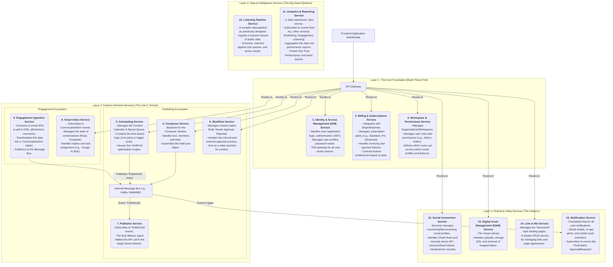

```mermaid
graph TD
    A[Frontend Application Web/Mobile];
    B[API Gateway];
    C[Internal Message Bus e.g., Kafka, RabbitMQ];
    A --> B;

    subgraph "Layer 1: The Core Foundation (Build These First)"
        direction LR
        B -- Routes to --> F_IAM;
        F_IAM("<strong>1. Identity & Access Management (IAM) Service</strong><br/>- Handles user registration, login, authentication (JWT).<br/>- Manages user profiles, password resets.<br/>- THE gateway for all user-centric actions.");
        
        B -- Routes to --> F_Billing;
        F_Billing("<strong>2. Billing & Subscriptions Service</strong><br/>- Integrates with Stripe/Braintree.<br/>- Manages subscription plans (e.g., Standard, Pro, Advanced).<br/>- Handles invoicing and payment failures.<br/>- Controls feature entitlements based on plan.");

        B -- Routes to --> F_Workspace;
        F_Workspace("<strong>3. Workspace & Permissions Service</strong><br/>- Manages Organizations/Workspaces.<br/>- Manages user roles and permissions (e.g., Admin, Editor).<br/>- Defines which users can access which social profiles and features.");
    end

    subgraph "Layer 2: Feature-Oriented Services (The User's Toolset)"
        direction TB
        subgraph "Publishing Ecosystem"
            B -- Routes to --> P_Composer;
            P_Composer("<strong>4. Composer Service</strong><br/>- Backend for the 'Compose' window.<br/>- Handles text, mentions, and links.<br/>- Assembles the draft post object.");
            
            P_Composer --> C;
            
            B -- Routes to --> P_Scheduler;
            P_Scheduler("<strong>5. Scheduling Service</strong><br/>- Manages the Content Calendar & Sprout Queue.<br/>- Contains the time-based logic (cron jobs) to trigger posts.<br/>- Houses the 'ViralPost' optimization engine.");
            
            P_Scheduler -- Publishes 'PublishJob' event --> C;

            B -- Routes to --> P_Workflow;
            P_Workflow("<strong>6. Workflow Service</strong><br/>- Manages content states: Draft, Needs Approval, Rejected.<br/>- Handles the internal and external approval process.<br/>- Acts as a state machine for content.");

            C -- Event: 'PublishJob' --> P_Publisher;
            P_Publisher("<strong>7. Publisher Service</strong><br/>- Subscribes to 'PublishJob' events.<br/>- The final delivery agent.<br/>- Makes the API call to the target social network.");
        end

        subgraph "Engagement Ecosystem"
            E_Ingestor("<strong>8. Engagement Ingestion Service</strong><br/>- Connects to social APIs to pull in DMs, @mentions, comments.<br/>- Standardizes this data into a 'ConversationItem' object.<br/>- Publishes to the Message Bus.");
            
            E_Ingestor --> C;
            
            B -- Routes to --> E_Inbox;
            E_Inbox("<strong>9. Smart Inbox Service</strong><br/>- Subscribes to 'ConversationItem' events.<br/>- Manages the state of conversations (Read, Complete).<br/>- Handles replies and task assignment (e.g., 'Assign to Bob').");
        end
    end
    
    subgraph "Layer 3: Data & Intelligence Services (The Big Data Pipelines)"
        direction TB
        L_Pipeline("<strong>10. Listening Pipeline Service</strong><br/>- A complex data pipeline as previously designed.<br/>- Ingests a massive stream of public data.<br/>- Enriches, matches against user queries, and stores results.");
        
        A_Pipeline("<strong>11. Analytics & Reporting Service</strong><br/>- A 'data warehouse' style service.<br/>- Subscribes to events from ALL other services (Publishing, Engagement, Listening).<br/>- Aggregates this data into performance reports.<br/>- Powers the 'Post Performance' and trend reports.");
    end

    subgraph "Layer 4: Shared & Utility Services (The Helpers)"
        direction LR
        B -- Routes to --> U_Social;
        U_Social("<strong>12. Social Connection Service</strong><br/>- Securely manages connecting/disconnecting social profiles.<br/>- Handles OAuth flows and securely stores API tokens/refresh tokens.<br/>- Hardened for security.");
        
        B -- Routes to --> U_DAM;
        U_DAM("<strong>13. Digital Asset Management (DAM) Service</strong><br/>- The 'Asset Library'.<br/>- Handles uploads, storage (S3), and retrieval of images/videos.");
        
        B -- Routes to --> U_Link;
        U_Link("<strong>14. Link in Bio Service</strong><br/>- Manages the 'SproutLink' style landing pages.<br/>- A simple CRUD service for managing links and page appearance.");
        
        C -- Events trigger --> U_Notifications;
        U_Notifications("<strong>15. Notification Service</strong><br/>- Centralized hub for all user notifications.<br/>- Sends emails, in-app alerts, and mobile push reminders.<br/>- Subscribes to events like 'PostFailed', 'ApprovalRequired'.");
    end

```